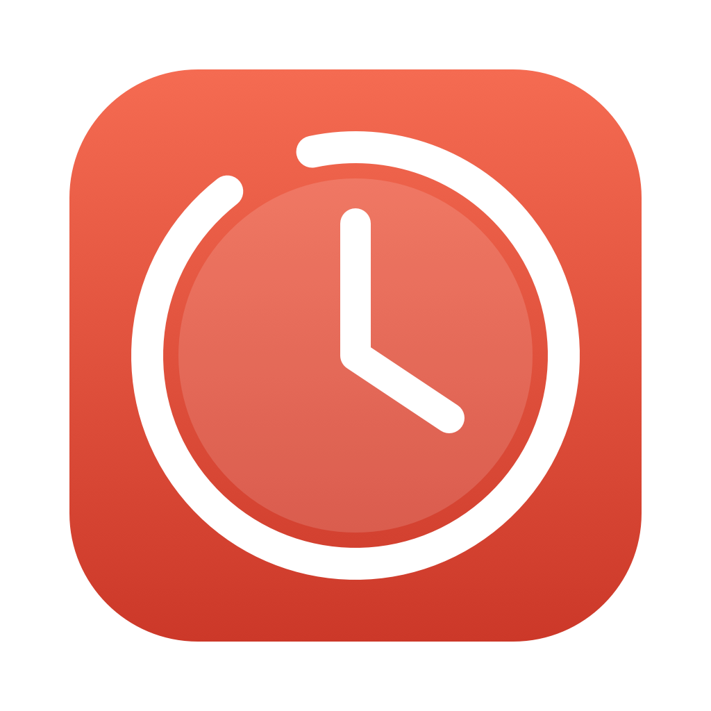

<p align="center">
  
</p>

<h1 align="center">Focus</h1>

<p align="center">
  A minimal Pomodoro timer that lives in your macOS menu bar,<br>
  with tags to track where your focus goes and built-in noise to get into deep work.
</p>

<p align="center">
  
  
  
</p>

---

## Why

Most Pomodoro apps are either a full window you have to keep around or a subscription with
cloud sync you never asked for. Focus is a tiny clock in the menu bar: one click to start,
a glance to see how much is left, and a simple record of how many pomodoros went to each
project. No account, no Dock icon, no data leaving your Mac.

## Features

**⏱ Timer in the menu bar**
- The menu bar icon shows the remaining time while a pomodoro runs, and its ring empties as time passes.
- Focus → break cycle. Breaks start on their own; you decide when the next pomodoro starts.
- Start, pause, restart or skip a phase. The space bar starts/pauses.
- A notification and a soft bell chime when each phase ends: descending when a pomodoro ends, ascending when a break ends.

**🏷 Tags**
- Every pomodoro belongs to a tag: a project, a client, a topic.
- Create and delete tags, pick their color, and see how many pomodoros each one has today and in total.
- Deleting a tag keeps its pomodoros as *No tag*, so your history is never lost.

**🎧 Background noise for deep work**
- White, pink or brown noise while a pomodoro runs, and only then: it stops on pause, on break and when the pomodoro ends.
- Click the speaker to mute/unmute without stopping the pomodoro; hover it to change the volume (drag the slider or click the small speakers to step it).
- Keeps playing when you switch outputs (headphones ↔ speakers).
- Generated in real time in stereo, with independent noise for each ear and a gentle low-pass,
  so it sounds wide and soft instead of harsh. No audio files, so there is no loop to notice.

**⚙️ Settings**
- Pomodoro and break length (type them or use the arrows), and whether to chime when a phase ends.

## Install

Requires macOS 14 or later and Swift 5.10+ (Xcode or the Command Line Tools).

```bash
git clone https://github.com/joseguzmann/focus.git
cd focus
./scripts/build-app.sh --install   # builds Focus.app, copies it to /Applications and opens it
```

Or `./scripts/build-app.sh` alone to just build `build/Focus.app`.

If Xcode is installed but its license hasn't been accepted, the scripts fall back to the
Command Line Tools automatically. The app is signed ad hoc, which is fine for running it on
your own Mac.

## Privacy

Everything (settings, tags, and the history of completed pomodoros) is stored in
`UserDefaults` on your Mac. Focus makes no network requests.

## Development

```bash
swift run   # runs without bundling (notifications need the .app, so they are skipped)
```

| File | Contents |
| --- | --- |
| `Sources/Focus/FocusApp.swift` | Entry point, `MenuBarExtra` and the menu bar icon |
| `Sources/Focus/FocusTimer.swift` | State: timer, tags, completed pomodoros, notifications |
| `Sources/Focus/PopoverView.swift` | Views: Timer, Tags, Settings |
| `Sources/Focus/NoisePlayer.swift` | White/pink/brown noise generator (`AVAudioEngine`) |
| `Sources/Focus/ChimePlayer.swift` | Synthesized end-of-phase bell chime |
| `scripts/build-app.sh` | Builds and bundles `Focus.app` |
| `scripts/make-icon.sh` | Regenerates `Resources/AppIcon.icns` from `scripts/make-icon.swift` |

Each completed pomodoro is stored individually (date, length, tag), so daily or weekly
history views can be built on top later without losing data.
